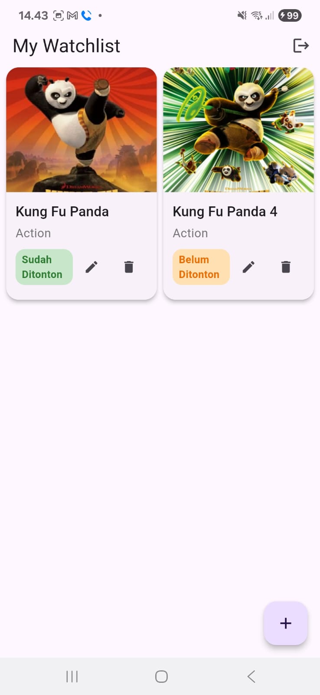
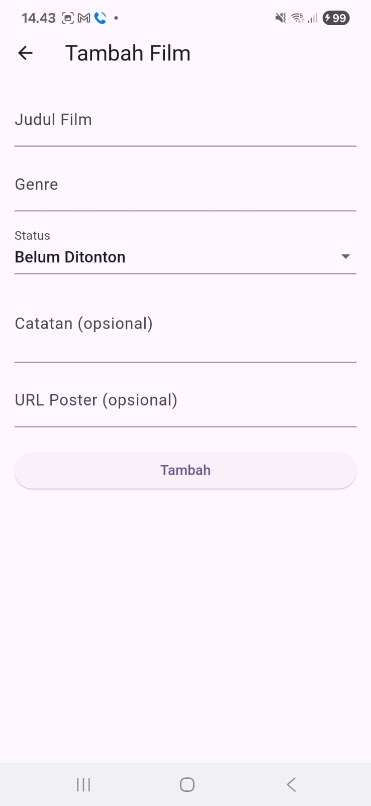
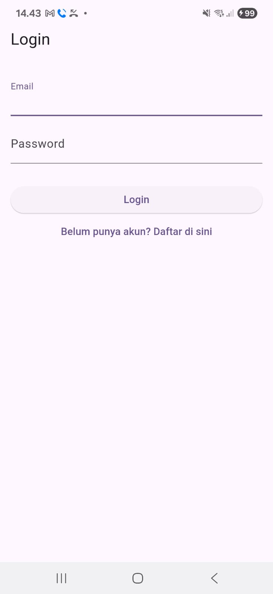

# 🎬 CinemaTrack

CinemaTrack adalah aplikasi **watchlist film** berbasis Flutter yang memungkinkan pengguna untuk menyimpan, mengelola, dan melacak daftar film yang ingin mereka tonton. Aplikasi ini menggunakan **Firebase Authentication** untuk login/register, serta **Cloud Firestore** untuk menyimpan data setiap pengguna.

## ✨ Fitur Utama

- 🔐 Login dan Register dengan Firebase Authentication
- 📄 CRUD Watchlist (Create, Read, Update, Delete) untuk film
- 📦 Data tersimpan per pengguna (private per akun) di Firestore
- 🎨 UI bersih dan responsif dengan Material Design
- ☁️ Terintegrasi penuh dengan Firebase

## 📱 Tampilan Aplikasi

| Home Screen | Add/Edit Movie | Login/Register |
|-------------|----------------|----------------|
|  |  |  |

> *Tambahkan screenshot di folder `screenshots/` lalu sesuaikan link-nya di atas.*

## 🛠️ Teknologi yang Digunakan

- [Flutter](https://flutter.dev/)
- [Firebase Authentication](https://firebase.google.com/docs/auth)
- [Cloud Firestore](https://firebase.google.com/docs/firestore)

## 🚀 Instalasi

1. Clone repository:
   ```bash
   git clone https://github.com/USERNAME/CinemaTrack.git
   cd CinemaTrack
